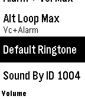
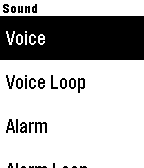

# PlaySoundMobile

Proof of concept for a **Find my Phone** feature on iOS using a Pebble watch. iOS is notoriously locked down — this explores whether `Pebble.playSound()` can be leveraged to trigger audible alerts from the watch despite Apple's limitations.

Select a sound type from the menu, and the C side tells PebbleKit JS to call `Pebble.playSound()` on iOS.

> **Requires:** the companion mobile app running on the paired iPhone — [coredevices/mobileapp](https://github.com/coredevices/mobileapp)

## Features

- Voice / Alarm / SMS sounds and their loops
- Volume control: max (with exact step calc), down, show current %
- **Alarm + Vol Max**: raises volume to max, then plays alarm
- **Voice+Alarm+Max Lp**: raises volume to max, then alternates voice/alarm every 1.5s (select again to stop)

## Build

Requires a custom PebbleOS SDK built from [PebbleOS](../PebbleOS/):

```sh
# Build the SDK (once)
cd ../PebbleOS
pip install -r requirements.txt
./waf configure --board asterix --internal_sdk_build
./waf build
./waf bundle

# Build the app
pebble sdk install --tintin /../PebbleOS
pebble clean && pebble build --sdk tintin

```

> **Target:** `flint` only. Uses the local SDK at `PebbleOS/build/sdk/flint`.

## Screenshots





